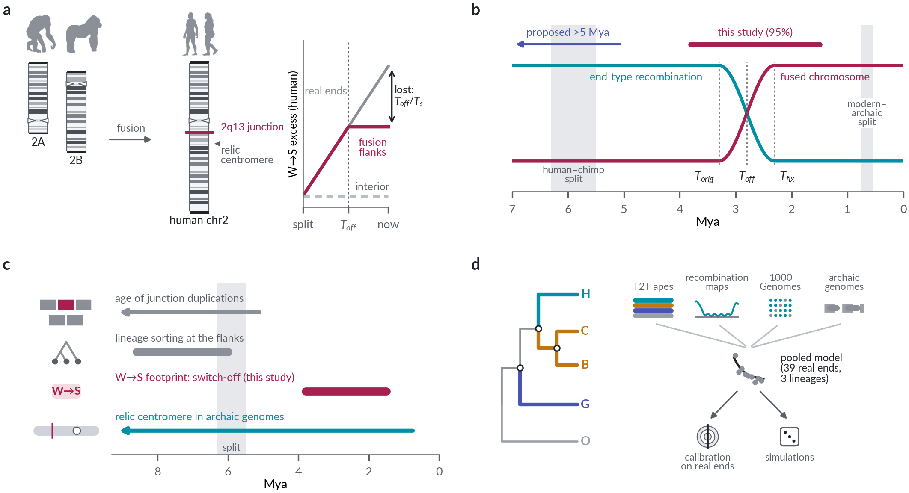

# hsa2-fusion-dating

[](LICENSE)


**Dating the human chromosome 2 fusion from the recombination footprint of its former telomeres.**

Code, curated results and figures for the article
*"Complete ape genomes date the human chromosome 2 fusion to the Pliocene–Pleistocene transition"*
(Gogolewski et al., in preparation).

<p align="center"></p>

## In brief

Human chromosome 2 formed by the fusion of two ancestral chromosomes that are still separate in the other great apes.
While 2A and 2B were chromosome ends, their subtelomeres recombined at high rates and accumulated GC-rich (W→S)
substitutions through GC-biased gene conversion. Once fused, they became interior sequence.

Using complete (T2T) ape genomes with reconstructed ancestors, we measure how much of that end signal the human
flanks retain, and fit a population-genetic model pooled over 39 real chromosome ends on three ape lineages.

- The former ends are **interstitial today**, by three independent measures (deCODE recombination, present-day gBGC
  strength, polymorphism).
- They stopped behaving as ends (**T_off**) about **2.8 Mya** (95% CI 1.5–3.8; 2.0–3.6 across configurations).
  The model is calibrated on real ends (95% coverage), and **>5 Mya is excluded** in every configuration.
- **Lineage sorting at the fusion site dates the ancestral sequence, not the fusion.** It is one-sided and not
  junction-centred, as structured-coalescent simulations show.

This repository supersedes the 2022 pipeline ([bposzewiecka/tytus](https://github.com/bposzewiecka/tytus);
Poszewiecka *et al.* 2022, *BMC Genomics*).

## Quick start: regenerate all figures and tables (under a minute)

The curated intermediate results in `results/` (about 22 MB) are enough to rebuild every main and supplementary
figure, Supplementary Tables S2–S6, Supplementary Data 1 and the numbers quoted in the text:

```bash
conda env create -f environment.yml && conda activate hsa2
make figures        # -> results/figures/
make test           # smoke tests of the model identities and simulators (~1 min)
```

The published versions of the figures are in [`figures/`](figures/).

## Full reproduction from public data

See **[REPRODUCE.md](REPRODUCE.md)** for the complete path, from downloading the T2T ape alignments to the final
model, stage by stage, with commands, expected outputs and run times. The full analysis took about one day of wall
time on a single 80-core server.

## Repository layout

| Path | Contents |
|---|---|
| `workflow/00_data` | download of all public inputs |
| `workflow/01_substitutions` | branch-specific substitutions from the Cactus alignment (A1) |
| `workflow/02_windows` | 100-kb window tables with each species' telomere distance (A3) |
| `workflow/03_present_day` | recombination today (A5), gBGC strength from site-frequency spectra (A6, A12c), recombination calibration (A12), ape LD maps (A13) |
| `workflow/04_time_strata` | archaic-shared / human-specific / polymorphic strata (A7) |
| `workflow/05_estimators` | 2022 reproduction (A0), clustered statistic (A2), haplotype cells (A14), single-reference estimators on real ends (A15) |
| `workflow/06_pooled_model` | **pooled model, profile likelihood, real-end calibration, two-flank test (A4, A4b)** |
| `workflow/07_theory_simulations` | exact Wright–Fisher (A10a, A10d), SLiM (A10b), msprime (A10c), numerical checks (M0) |
| `workflow/08_lineage_sorting` | ILS profiles (A8), flank diagnostics (A16), relic centromere (B1) |
| `workflow/09_figures` | all figures, supplementary tables, `numbers.tex` |
| `results/` | curated intermediate results (see [`results/README.md`](results/README.md)) |
| `figures/` | final figures and Supplementary Data 1 |
| `utils/`, `config/`, `tests/` | job wrapper and monitor, installer, haplotype role mappings, smoke tests |
| `archive/` | superseded or exploratory scripts, kept for provenance only |

Step identifiers (A1, A4, …) match the Methods and the file names in `results/`.

## Figures and tables

| Item | Command | Inputs in `results/` |
|---|---|---|
| Fig. 1 (overview) | `F_schematic.py` | `workflow/09_figures/assets/` (hg38 chr2 cytobands; public-domain PhyloPic silhouettes, see `SOURCES.txt`) |
| Fig. 2 (present day) | `F_make_figures.py --only 1` | A5, A6, A12c, A7 |
| Fig. 3 (pooled model) | `F_make_figures.py --only 2` | A3, A4, A15 |
| Fig. 4 (lineage sorting) | `F_make_figures.py --only 3` | A8, A16, A10 |
| Fig. 5 (validation) | `F_make_figures.py --only 4` | A10, A10b, A4 |
| Supp. Fig. S1 | `F_make_figures.py --only S1` | A16*, A13 |
| Supp. Figs. S2–S5 | `F_supp_figures.py` | A15, A12, A13, A16 |
| Supp. Tables S2–S6, Supplementary Data 1 | `F_supp_tables.py` | A10, A10b, A14, A4, A15, … |

## Data

All inputs are public:
- T2T ape assemblies and Cactus alignments (Yoo *et al.* 2025, *Nature*);
- CHM13 (Nurk *et al.* 2022);
- deCODE recombination maps (Palsson *et al.* 2025; Halldorsson *et al.* 2019);
- 1000 Genomes on CHM13 (Byrska-Bishop *et al.* 2022);
- Altai, Vindija, Chagyrskaya and Denisova genomes;
- great-ape LD maps (Stevison *et al.* 2016).

`workflow/00_data` downloads them.

## Citation

Please cite the article (reference to be added on publication) and this repository ([CITATION.cff](CITATION.cff)).

## License

[MIT](LICENSE).
